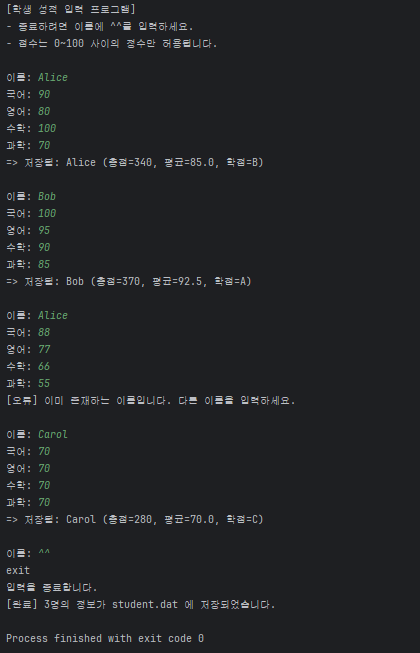
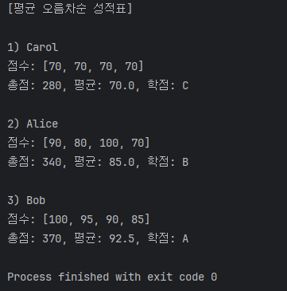
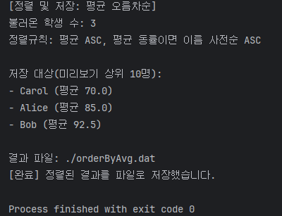

# Team Mission v.1 - 학생 성적 프로그램

## 📌 프로젝트 개요

- 이 프로젝트는 **학생 성적 관리 프로그램**입니다. 
- 사용자는 **학생 이름과 과목별 점수**를 입력할 수 있으며, 입력한 정보는 **student.dat**에 직렬화되어 저장됩니다.
- 저장된 데이터는 불러와서 평균 점수를 기준으로 정렬된 성적표를 출력하거나, 정렬된 결과를 orderByAvg.dat에
저장합니다.

## 🛠 주요 기능

- **StudentInput** 
  - 학생 성적 정보를 입력받아 student.dat에 저장
  - 이름 중복 검사
  - 점수 유효성 검사 (0~100)
  - 과목: 국어, 영어, 수학, 과학
  - 평균 점수에 따른 학점 부여
    - A: 90 이상
    - B: 80 이상
    - C: 70 이상
    - D: 60 이상
    - F: 60 미만
  - 종료 조건: 이름에 ^^ 입력 시
  

- **StudentOutput** 
  - 저장된 student.dat 파일에서 학생 정보를 불러오기
  - 평균 오름차순 정렬
  - 정렬된 성적표 출력
  

- **SortedStudent**
  - 저장된 학생 데이터를 불러옴
  - TreeSet과 Comparator를 이용해 평균 ASC, 동률 시 이름 사전순 ASC로 정렬
  - 정렬된 결과 일부(상위 10명) 미리보기 출력
  - 최종 정렬된 결과를 orderByAvg.dat 파일에 저장


## 📂 프로젝트 구조
```
TeamMission1/
├── Student.java        # 학생 객체 정의 (Serializable)
├── StudentInput.java   # 학생 입력 및 student.dat 저장
├── StudentOutput.java  # student.dat 불러와 평균 오름차순 성적표 출력
├── SortedStudent.java  # StudentComparator 정의, stuent.dat 불러와 정렬된 결과를 orderByAvg.dat 저장
```

## 💾 데이터 저장 방식

- **student.dat**
    - HashMap<String, Student> 형태로 저장

- **orderByAvg.dat**
    - TreeSet<Student> 형태로 저장 
    - StudentComparator class에서 compare를 overriding하여 average 오름차순으로 저장

## ▶ 실행 예시

**1. 성적 입력 (StudentInput)**



**2. 성적 출력 (StudentOutput)**



**3. 정렬 후 저장 (SortedStudent)**



## 🚀 실행 흐름

- **StudentInput 실행**
  - loadcheck() → printUsage() → checkKeyAndInputData() → saveData() → student.dat 생성

- **StudentOutput 실행** 
  - loadObjectFromFile() → rearrangeData() → printInfo() → 성적표 확인

- **SortedStudent 실행**
  - loadObjectFromFile() → createTreeSet() → 평균 기준 정렬 → printResult() → outputObject() → orderByAvg.dat 생성

## ⚠️ 주의 사항

- student.dat 파일이 없는 경우 file.createNewFIle() 호출해서 빈 파일을 강제로 생성
- student.dat 파일에 object가 write되지 않은 경우, StdentOutput과 SortedStudent에서 오류가 발생할 수 있음
- orderByAvg.dat은 실행 시 새로 덮어씀
- Comparator를 익명 객체로 생성하여 compare method를 overriding하면 직렬화가 불가능하여 NotSerializableException 발생
- 직렬화된 파일은 자바 환경에서만 정상적으로 읽을 수 있음

